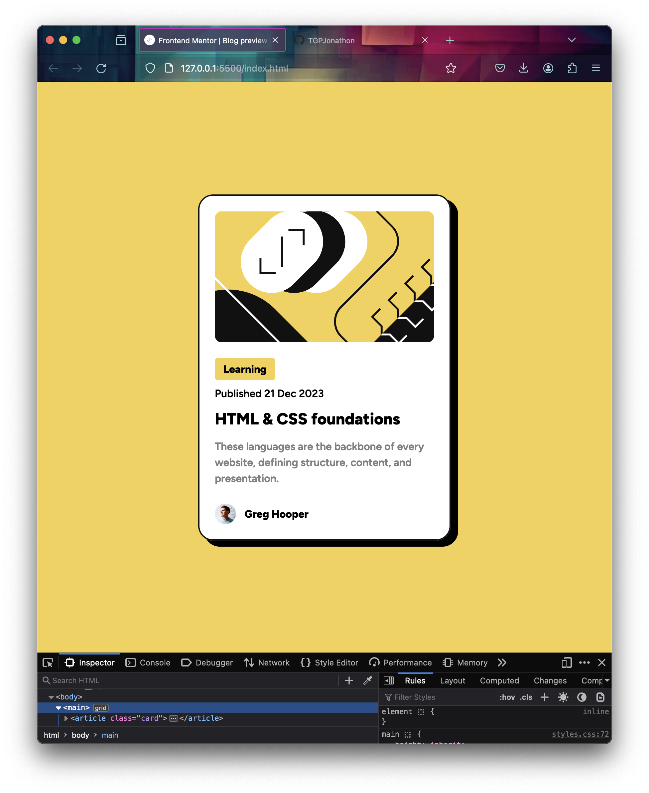

# Frontend Mentor - Blog preview card solution

This is a solution to the [Blog preview card challenge on Frontend Mentor](https://www.frontendmentor.io/challenges/blog-preview-card-ckPaj01IcS). Frontend Mentor challenges help you improve your coding skills by building realistic projects.

## Table of contents

- [Overview](#overview)
  - [Screenshot](#screenshot)
  - [Links](#links)
- [My process](#my-process)
  - [Built with](#built-with)
  - [What I learned](#what-i-learned)
  - [Continued development](#continued-development)

## Overview

This is the fastest I've finished one of these. Only took about 20-30 minutes. Getting the box shadow right was the hardest part, but I ended up using a box shadow generator for that one.

### Screenshot

### Links

- Solution URL: [https://github.com/TGPJonathon/frontend-mentor-result](https://github.com/TGPJonathon/frontend-mentor-result)
- Live Site URL: [https://tgpjonathon.github.io/frontend-mentor-result/](https://tgpjonathon.github.io/frontend-mentor-result/)

## My process

### Built with

- Semantic HTML5 markup
- CSS custom properties
- Flexbox

### What I learned

I learned you should not try to make a box shadow from scratch. Using a generator is much easier. It can also be a tad difficult to eyeball if margins match up.

### Continued development

I want to get better at Grid & Flex.
